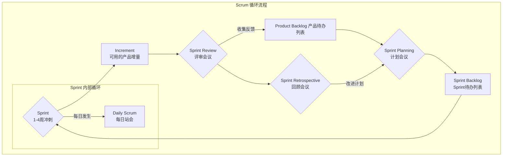

# Scrum 敏捷开发框架

> Scrum 是一个用于开发、交付和持续改进产品的迭代式增量敏捷框架，其核心是通过短暂的迭代周期（Sprint）和明确的角色、事件、工件来拥抱变化、快速交付价值并持续优化。

> 背景：在启动大创项目时，项目管理让人心累，我作为负责人，要探索自己负责的边界在哪里。我探索 PMP 项目管理，决定使用 Agile 的 Scrum 框架来管理项目。
---

## 核心思想与应用场景

Scrum 的核心思想是承认**在项目开始时，你不可能知道所有事**，采用经验主义的方法（透明、检视、适应）来应对不确定性。这就是大创项目的起点现状。

* **解决了什么问题：**
    * 需求频繁变更，难以制定长期计划。
    * 客户在项目结束前无法看到任何可用的产品。
    * 团队沟通不畅，责任不明确。
    * 项目风险直到后期才暴露出来。

* **典型应用场景：**
    * **大创项目/初创公司产品开发：** 需求不明确，需要快速验证想法，快速迭代。
    * **大型软件项目：** 将复杂系统拆分为小模块，分批交付。
    * **任何不确定性高、需要快速响应变化的复杂工作。**

---

## Scrum 框架由“3个角色”、“5个事件”、“3个工件”组成，俗称 “3-5-3”。

### 关键组成部分 (Scrum 3-5-3)

1.  **三大角色 (Roles):**
    * **产品负责人 (Product Owner - PO):** **负责“做什么”**。定义产品功能，管理和优化产品待办列表（Product Backlog），确保团队的工作始终对齐商业目标。
      > 大部分时间在思考用户、市场和产品的未来。花时间去和用户交流，研究竞品，然后把这些思考转化为清晰的任务项。 `专注思考，果断决策。`
    * **Scrum Master:** **负责“怎么做得更好”**。Scrum框架的守护者和团队的仆人式领导，负责移除障碍、引导会议、确保团队遵循Scrum实践。
      > 大部分时间在观察团队的工作状态。关心团队开心吗？顺畅吗？有没有什么东西拖慢了我们的速度? `服务`
    * **开发团队 (Developers):** **负责“怎么做”**。一个跨职能的自组织团队，负责在每个Sprint中将待办事项转化为可交付的产品增量。
   
      > 在大创项目中，我身兼二职，有意识地将这两个角色的职责分开，可以在需要“定方向”时保持清晰的视野，在需要“理流程”时保持中立和服务的姿态。让管理更加清晰、高效，团队成员感觉更舒服。关键词是`有意识地分离职责`。

2.  **五大事件/会议 (Events):**

    > Scrum 以 5 个事件的形式提供了稳定的节奏来经常地和勤勉地`检视`。`检视`带来`适应`。`适应`就是如果过程的任何方面超出可接受的范围或所得的产品不可接受，就必须对当下的过程或过程处理的内容加以调整。调整工作必须尽快执行以最小化进一步的偏差。

    * **Sprint (冲刺):** Scrum的核心，一个固定长度（通常为1-4周）的时间盒，团队在此期间完成一个“完成”的、可发布的产品增量。
    * **Sprint 计划会议 (Sprint Planning):** 在Sprint开始时召开，PO阐述目标，团队共同选择并计划本次Sprint要完成的工作。
      > Sprint Planning 是有时间盒限定的，以一个月的 Sprint 来说最多为 8 个小时。对于更短的 Sprint，Sprint Planning 所需时间通常会更短。
    * **每日站会 (Daily Scrum):** 每天不超过15分钟的短会，团队成员同步进度（昨天做了什么，今天计划做什么，遇到了什么障碍），以快速调整计划。
    * **Sprint 评审会议 (Sprint Review):** 在Sprint结束时召开，团队向利益相关者（如客户、老师）展示本次Sprint完成的工作成果，并收集反馈。
      > 以一个月的 Sprint 来说，最多为 4 个小时。 对于更短的 Sprint，Sprint Review 通常所需的时间更短。
    * **Sprint 回顾会议 (Sprint Retrospective):** Sprint的最后一个事件，团队内部复盘，讨论哪些做得好，哪些可以改进，并制定下一轮的改进计划。
      > 以一个月的 Sprint 来说，最多为 3 个小时。对于更短的 Sprint， Sprint Retrospective 通常所需的时间更短。

4.  **三大工件 (Artifacts):**
    * **产品待办列表 (Product Backlog):** 一个动态的、按优先级排序的涌现清单，包含了产品未来所有可能的功能、修复和改进。
    * **Sprint 待办列表 (Sprint Backlog):** 在Sprint计划会议上，从Product Backlog中挑选出来的、本次Sprint需要完成的任务列表。
      > Sprint Goal （为什么做）、为 Sprint 选择的 Product Backlog 条目（做什么）以及交付 Increment 的可执行计划（如何做）组成。
    * **产品增量 (Increment):** 每个Sprint结束时产出的、可工作的、符合“完成”标准的产品版本。
      > 一项工作除非符合 Definition of Done ，否则不能将其视为 Increment 的一部分。

---

## 图示

使用Mermaid图表清晰地展示Scrum的循环流程。

---

## 关键词

### 涌现
* 项目的具体细节、真正的需求、以及最佳的解决方案，不是在项目开始前就全部规划好的，而是在开发过程中逐步清晰、浮现出来的，这叫做涌现。涌现的需要保证`透明`。
* 涌现让我保持良好的心态。不能期待每时每刻都有新的想法产出，要提升对枯燥工作的忍耐度。因为涌现灵感后，就要`重复`来实现，也只有在重复的过程中潜移默化增长对项目的理解，重复为涌现提供可能。
* `不透明`的例子：譬如做出来的项目要给医生用，登录功能有 Bug，但隐藏了它，只给医生看了一个漂亮的界面。那么医生就不会有真实的反馈，重要需求就无法涌现。这就是“导致做出降低价值并增加风险的决策”。
